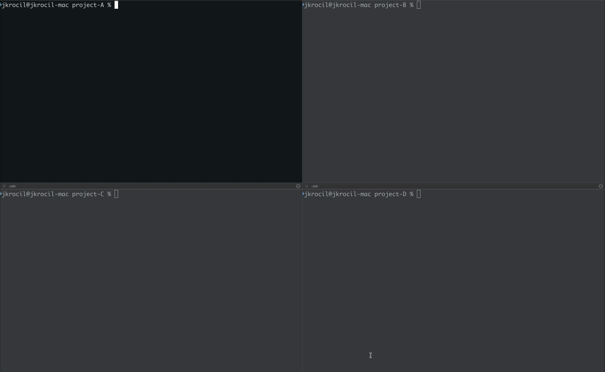

# `cl` - make your Claude Code sessions stand out

**Say goodbye to manually calling `/rename` and `/color` at the start of every single session just to tell your terminals apart. With `cl`, every session is auto-named and auto-colored with zero effort.**

[](https://www.zsh.org/)
[](https://claude.ai/code)
[](LICENSE)

---



## The Problem

Claude Code sessions launch with no name and no color by default. Open three terminals and run `claude` in each - you get three identical-looking sessions with no names and no colors. There's nothing to distinguish them visually, and context-switching between them means squinting at prompts or remembering which terminal is which.

## The Solution

A single shell function that wraps `claude` as `cl`. Just type `cl` instead of `claude`. That's it. You get:

1. **Named sessions** - automatically names each session after the current directory, or accepts a custom name as the first argument.
2. **Automatic color assignment** - scans running Claude processes, finds which colors are already taken, and picks an unused one. When all 8 colors are in use, it wraps around randomly.

## Usage

```
# Terminal 1 - named "api", gets a random color
~/projects/api $ cl

# Terminal 2 - named "web", gets a different random color
~/projects/web $ cl

# Terminal 3 - custom name, gets another unused color
~/projects/api $ cl "debug-auth"

# Continue the most recent session in this directory
~/projects/api $ cl --continue

# Resume a previous session by name
~/projects/api $ cl myproject --resume
```

## Installation

Paste the following into your agent:

```sh
Add the following function to my ~/.zshrc (if on macOS) or ~/.bashrc (if on Linux):

cl() {
  # Use first arg as session name, or fall back to current directory
  local name
  if [[ -z "$1" || "$1" == -* ]]; then
    name=$(basename "$PWD")
  else
    name="$1"
    shift
  fi

  # Skip auto-coloring for modes that conflict with the /color prompt
  local skip_color=0
  for arg in "$@"; do
    case "$arg" in
      -p|--print|-r|--resume|-c|--continue|--from-pr|-h|--help|-v|--version)
        skip_color=1
        break
        ;;
    esac
  done

  if (( skip_color )); then
    claude --name "$name" "$@"
    return
  fi

  # Find which colors are already used by running Claude sessions
  local all=(red green blue yellow purple orange pink cyan)
  local used=($(ps aux | grep -o '/color [a-z]*' | awk '{print $2}' | sort -u))

  # Pick a random color from the unused ones
  local avail=()
  for c in "${all[@]}"; do
    local taken=0
    for u in "${used[@]}"; do [[ "$c" == "$u" ]] && taken=1 && break; done
    (( taken == 0 )) && avail+=("$c")
  done
  [[ ${#avail[@]} -eq 0 ]] && avail=("${all[@]}")

  local n=${#avail[@]}
  local idx=$((RANDOM % n))
  [[ -n "$ZSH_VERSION" ]] && idx=$((idx + 1))  # zsh arrays are 1-indexed

  claude --name "$name" "$@" "/color ${avail[$idx]}"
}
```

Then open a new terminal window to start using `cl`.

## How It Works

1. **Name resolution** - uses the first argument as the session name, or falls back to the current directory basename.
2. **Color inventory** - runs `ps aux` to find all active Claude processes that have already been assigned a color via `/color`.
3. **Availability check** - filters the 8 available colors down to unused ones.
4. **Random pick** - selects a random color from the available pool (or from all colors if every color is taken).
5. **Launch** - starts `claude` with `--name`, forwards any extra arguments, and sends the `/color` command.

## Known limitations

The minimal `cl` above works best with a workflow where sessions are started fresh rather than resumed or continued. Auto-coloring is skipped for flags that conflict with the `/color` prompt (`--resume`, `--continue`, `--from-pr`, `--print`, `--help`, `--version`), and resumed sessions don't appear in the color inventory, so a new session could end up with the same color as an existing one that was resumed or continued.

That said, sessions originally started with `cl` will still have their name and color upon resuming or continuing.

## Experimental: for workflows with resumed and continued sessions

The default version detects used colors by scanning process arguments (`ps aux | grep '/color'`). This is simple and portable, but it misses sessions that were resumed or continued since they don't have `/color` in their process args.

The version below reads Claude Code's internal session files instead, which track color for all active sessions regardless of how they were started. This solves the color collision issue with resumed sessions. It is read-only and completely safe to use, but makes more assumptions about Claude Code internals (`~/.claude/sessions/` and `agentColor` in JSONL transcripts) that could change between versions.

Unless resuming or continuing sessions is an important part of your workflow, stick with the minimal version above.

To install the experimental version instead, paste the following into your agent:

```sh
Add the following function to my ~/.zshrc (if on macOS) or ~/.bashrc (if on Linux):

cl() {
  local name
  if [[ -z "$1" || "$1" == -* ]]; then
    name=$(basename "$PWD")
  else
    name="$1"
    shift
  fi

  local skip_color=0
  for arg in "$@"; do
    case "$arg" in
      -p|--print|-r|--resume|-c|--continue|--from-pr|-h|--help|-v|--version)
        skip_color=1
        break
        ;;
    esac
  done

  if (( skip_color )); then
    claude --name "$name" "$@"
    return
  fi

  local all=(red green blue yellow purple orange pink cyan)

  # Read colors from all active Claude sessions via internal session files
  local used=()
  for f in ~/.claude/sessions/*.json; do
    [ -f "$f" ] || continue
    local pid=$(grep -o '"pid":[0-9]*' "$f" | cut -d: -f2)
    kill -0 "$pid" 2>/dev/null || continue
    local sid=$(grep -o '"sessionId":"[^"]*"' "$f" | cut -d'"' -f4)
    local cwd=$(grep -o '"cwd":"[^"]*"' "$f" | cut -d'"' -f4)
    local project_dir=$(echo "$cwd" | tr '/' '-')
    local color=$(grep -o '"agentColor":"[a-z]*"' ~/.claude/projects/"$project_dir"/"$sid".jsonl 2>/dev/null | tail -1 | cut -d'"' -f4)
    [[ -z "$color" || "$color" == "default" ]] && color="cyan"
    used+=("$color")
  done

  local avail=()
  for c in "${all[@]}"; do
    local taken=0
    for u in "${used[@]}"; do [[ "$c" == "$u" ]] && taken=1 && break; done
    (( taken == 0 )) && avail+=("$c")
  done
  [[ ${#avail[@]} -eq 0 ]] && avail=("${all[@]}")

  local n=${#avail[@]}
  local idx=$((RANDOM % n))
  [[ -n "$ZSH_VERSION" ]] && idx=$((idx + 1))

  claude --name "$name" "$@" "/color ${avail[$idx]}"
}
```

Then open a new terminal window to start using `cl`.

## Requirements

- [Claude Code CLI](https://docs.anthropic.com/en/docs/claude-code) installed and available as `claude`
- Zsh or Bash

## License

[MIT](LICENSE)
